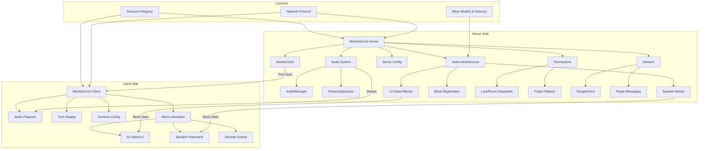
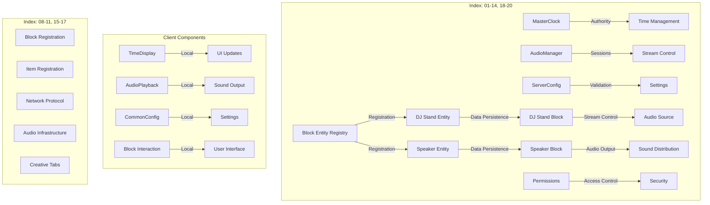
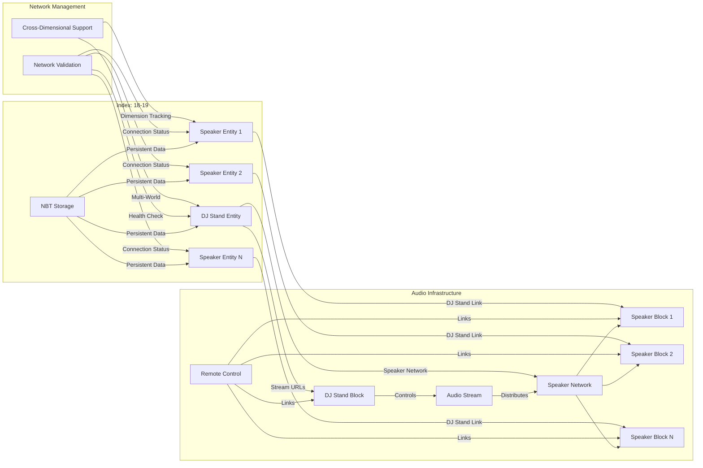
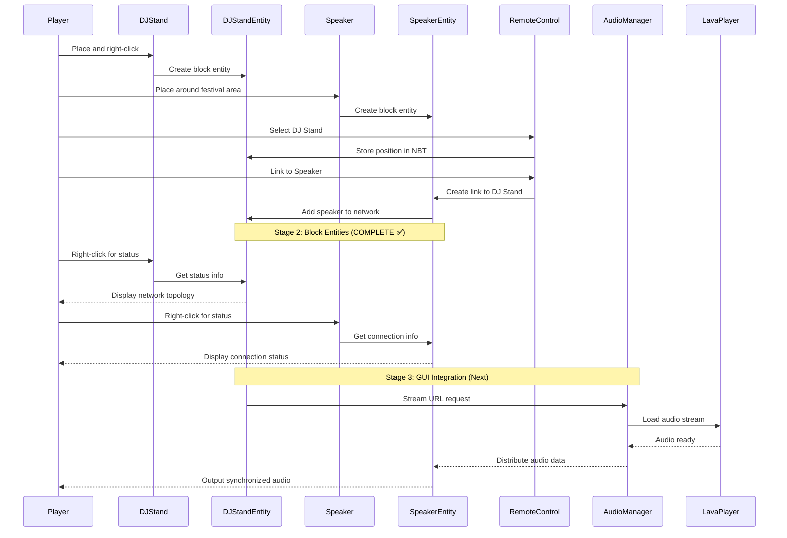
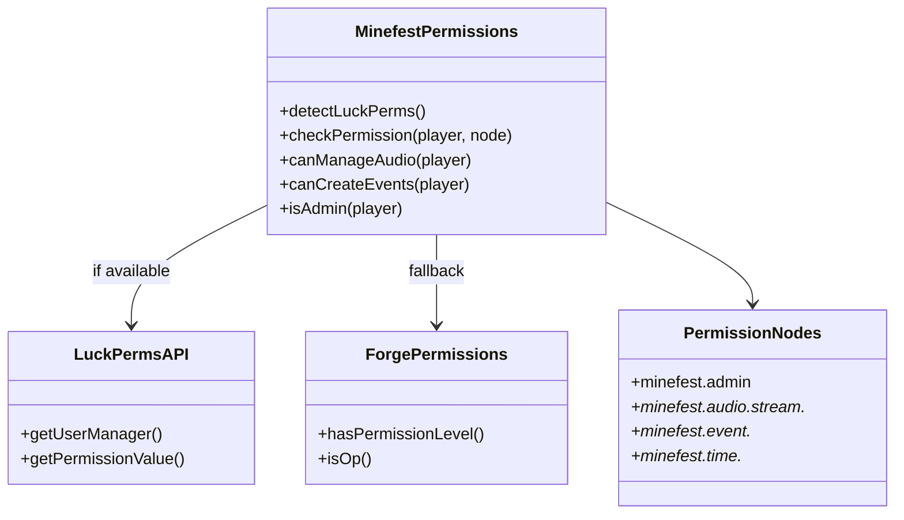
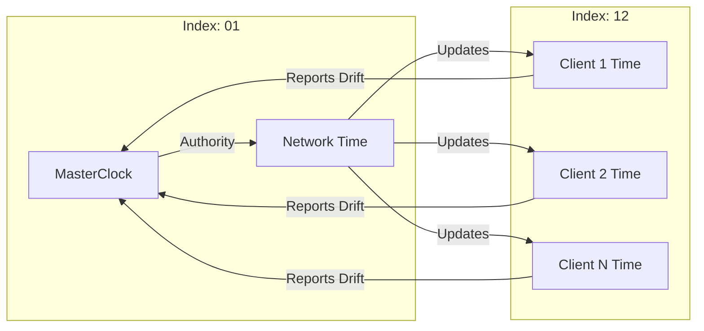
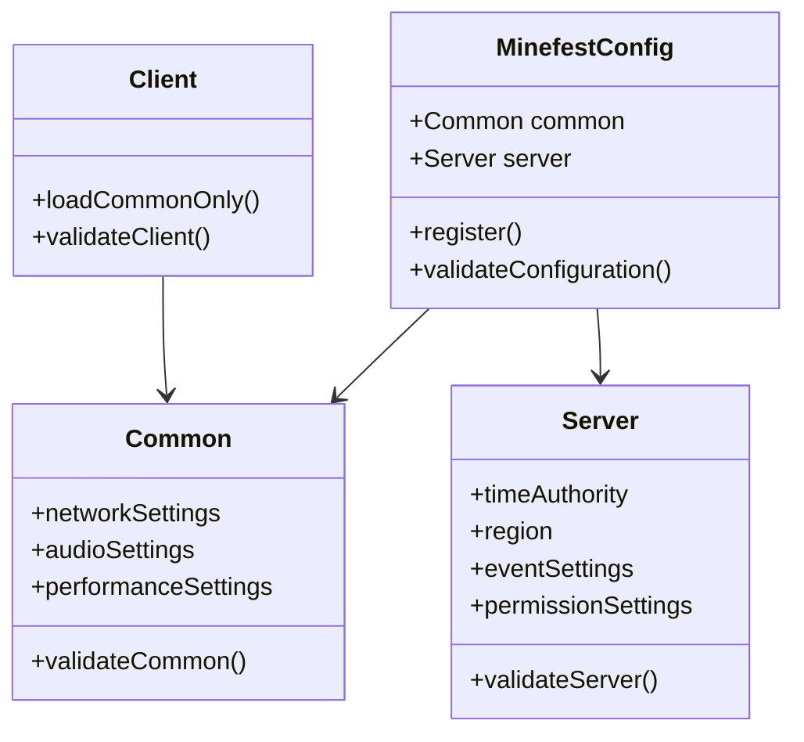
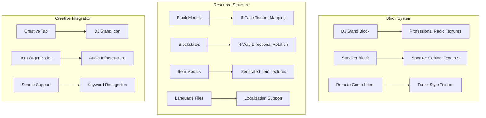
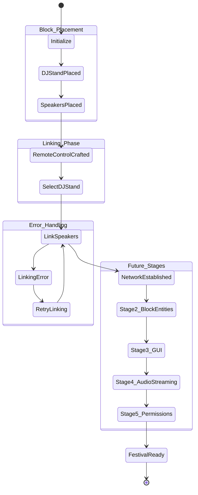
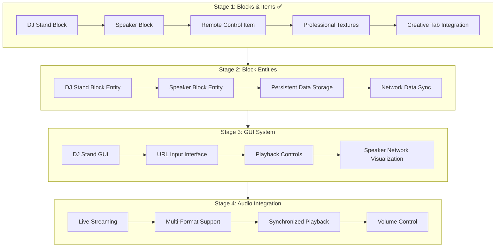

# Minefest-Core Architecture

## System Overview

Minefest-Core is designed as a revolutionary music festival platform for Minecraft, built on a robust server-client architecture with professional audio infrastructure and festival-scale deployment capabilities.

**Current Version**: 1.20.4-0.2.3.4  **Architecture Status**: Stage 3 Complete, Stage 4 On Hold (Client Compatibility Issue)

### Core Design Principles
- **Festival-Scale Performance**: Designed for thousands of concurrent users
- **Professional Audio Quality**: Industry-standard streaming and synchronization
- **Persistent Infrastructure**: Festival setups survive server restarts
- **Cross-Dimensional Support**: Festival stages can span multiple worlds
- **Modular Architecture**: Clean separation of concerns with component signposting

## High-Level Architecture

```
┌─────────────────────┐    ┌─────────────────────┐    ┌─────────────────────┐
│   Client Side       │    │   Network Layer     │    │   Server Side       │
├─────────────────────┤    ├─────────────────────┤    ├─────────────────────┤
│ DJ Stand GUI [21]   │◄──►│ GUI Synchronization │◄──►│ DJStandBlockEntity  │
│ Audio Playback      │    │ Audio Distribution  │    │ [18]                │
│ Time Display        │    │ Time Sync Packets   │    │ Speaker Networks    │
│ Creative Tab [11]   │    │ Permission Checks   │    │ AudioManager [05]   │
└─────────────────────┘    └─────────────────────┘    └─────────────────────┘
```

## Component Architecture

### Audio Infrastructure Components [Index: 15-27]#### DJ Stand System- **DJStandBlock [Index: 15]**: Main audio streaming controller with EntityBlock integration and GUI opening- **DJStandBlockEntity [Index: 18]**: Persistent data storage for stream URLs, speaker networks, and audio configuration- **DJStandScreen [Index: 21]**: Professional control panel GUI with real-time network monitoring and stream controls- **DJStandMenuProvider [Index: 22]**: Menu provider system for GUI-block entity integration and data synchronization#### Speaker System- **SpeakerBlock [Index: 16]**: Audio output device with EntityBlock integration and network participation- **SpeakerBlockEntity [Index: 19]**: Persistent DJ Stand linking, connection validation, and audio configuration- **SpeakerScreen [Index: 24]**: Speaker configuration GUI with individual controls#### Control System- **RemoteControlItem [Index: 17]**: Enhanced linking tool with block entity integration and comprehensive feedback#### Stage 4 Audio Integration System [Index: 25-27]- **DJStandAudioBridge [Index: 25]**: Audio streaming coordination layer between DJ Stands and LavaPlayer (16KB)- **NetworkAudioManager [Index: 26]**: Network audio distribution system for speaker networks (22KB)- **StreamValidator [Index: 27]**: Enterprise security validation with access tokens and stream protection (26KB)

### Server-Side Components [Index: 01-14]

## Package Structure

```
com.minefest.essentials/
├── MinefestCore.java        # Main mod class [Index: 02]
├── audio/                   # Audio streaming implementation  
│   ├── AudioManager.java    # Server-side audio management [Index: 05]
│   ├── MinefestAudioLoadHandler.java # LavaPlayer integration [Index: 07]
│   └── StreamingSession.java # Session state management [Index: 06]
├── blocks/                  # Audio infrastructure blocks
│   ├── DJStandBlock.java    # DJ Stand controller [Index: 15]
│   ├── SpeakerBlock.java    # Speaker output device [Index: 16]
│   └── entity/              # Block entities for persistent data storage
│       ├── DJStandBlockEntity.java  # DJ Stand data persistence [Index: 18]
│       └── SpeakerBlockEntity.java  # Speaker data persistence [Index: 19]
├── items/                   # Tools and control items
│   └── RemoteControlItem.java # Speaker linking tool [Index: 17]
├── init/                    # Common initialization and registry
│   ├── ModBlocks.java       # Block registration [Index: 09]
│   ├── ModItems.java        # Item registration [Index: 08]
│   ├── ModCreativeTabs.java # Creative tab registration [Index: 11]
│   └── ModBlockEntities.java # Block entity registration [Index: 20]
├── permissions/             # Permission system integration
│   └── MinefestPermissions.java # LuckPerms integration [Index: 14]
├── config/                  # Configuration handling
│   └── MinefestConfig.java  # Side-specific config management [Index: 10]
├── network/                 # Network and synchronization
│   └── TimeSync.java        # Server-side time sync [Index: 03]
├── timing/                  # Time management
│   ├── MasterClock.java     # Server-side time authority [Index: 01]
│   └── ClientTimeSync.java  # Client sync data structure [Index: 12]
├── test/                    # Testing utilities
│   └── ServerTestBroadcaster.java # Test broadcasting [Index: 13]
└── bungee/                  # Server-side BungeeCord integration
    └── MinefestBungee.java  # BungeeCord plugin messaging [Index: 04]
```

## System Overview



## Component Separation



## Audio Infrastructure System



## Audio System Flow



## Permission System Architecture



## Time Synchronization



## Configuration System



## Resource & Asset System



## Event Flow - Audio Infrastructure



## Development Stages Architecture



## Component Index Reference

### Core Infrastructure [Index: 01-04]
- **[01] MasterClock**: Central timing authority with millisecond precision
- **[02] MinefestCore**: Main mod initialization and lifecycle management
- **[03] TimeSync**: Network synchronization protocol implementation
- **[04] MinefestBungee**: BungeeCord proxy integration for multi-server

### Audio & Streaming [Index: 05-07]
- **[05] AudioManager**: LavaPlayer integration and session management
- **[06] StreamingSession**: Individual audio session state tracking
- **[07] MinefestAudioLoadHandler**: LavaPlayer event handling and callbacks

### Registration & Resources [Index: 08-11]
- **[08] ModItems**: Item registration including Remote Control
- **[09] ModBlocks**: Block registration for DJ Stand and Speaker
- **[10] MinefestConfig**: Configuration management with TOML support
- **[11] ModCreativeTabs**: Creative tab with audio infrastructure organization

### Client & Testing [Index: 12-13]
- **[12] ClientTimeSync**: Client-side time synchronization data
- **[13] ServerTestBroadcaster**: Development testing and metrics validation

### Extensions [Index: 14-17]
- **[14] MinefestPermissions**: LuckPerms integration with Forge fallback
- **[15] DJStandBlock**: Audio streaming controller block
- **[16] SpeakerBlock**: Audio output device block
- **[17] RemoteControlItem**: Speaker linking and management tool

### Block Entities [Index: 18-19]
- **[18] DJStandBlockEntity**: DJ Stand data persistence
- **[19] SpeakerBlockEntity**: Speaker data persistence

### Registration & GUI Components [Index: 20-24]- **[20] ModBlockEntities**: Block entity registration- **[21] DJStandScreen**: DJ Stand control panel GUI- **[22] DJStandMenuProvider**: Menu provider system for GUI integration- **[23] ModMenuTypes**: Menu type registration- **[24] SpeakerScreen**: Speaker configuration GUI### Stage 4 Audio Integration [Index: 25-27]- **[25] DJStandAudioBridge**: Audio streaming coordination layer (16KB)- **[26] NetworkAudioManager**: Network audio distribution system (22KB)- **[27] StreamValidator**: Enterprise security validation system (26KB)---*Architecture Version: 1.20.4-0.2.3.4*  *Last Updated: 2025-05-24* 