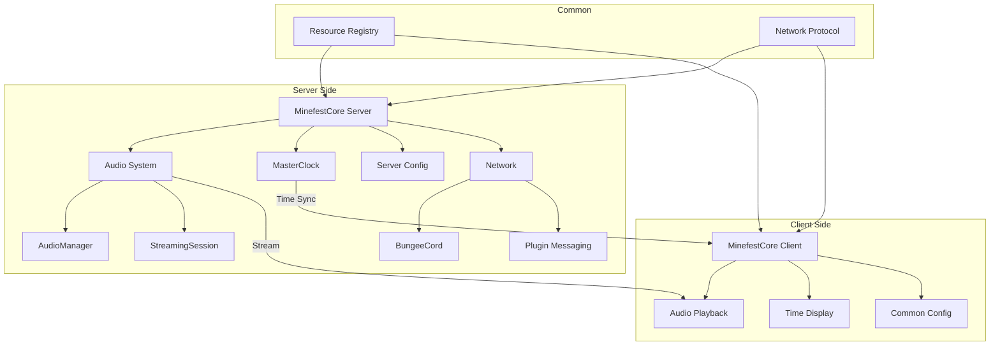
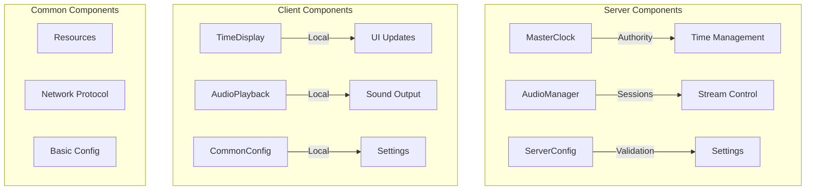
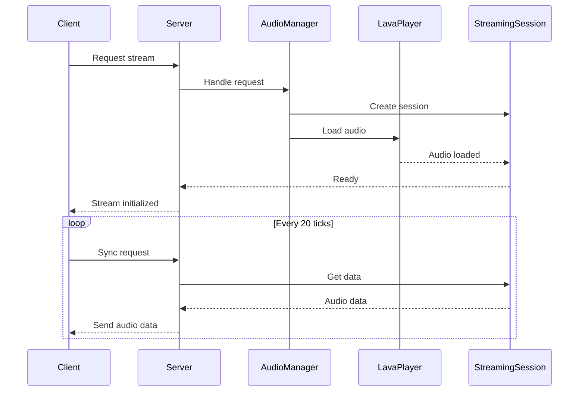
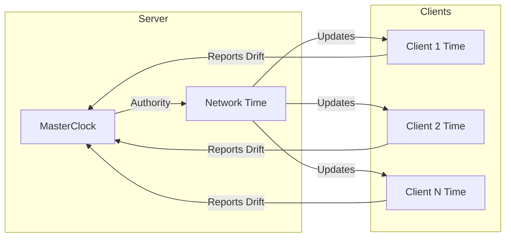
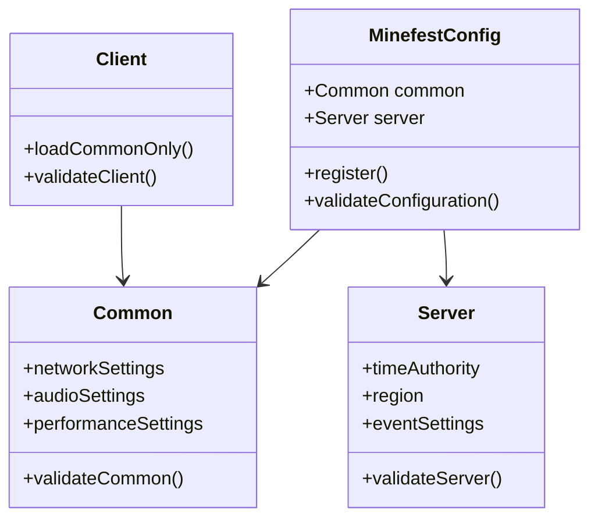
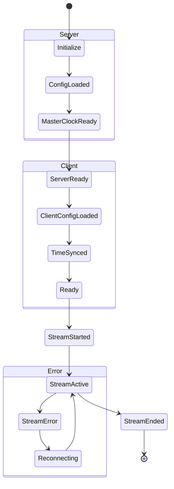
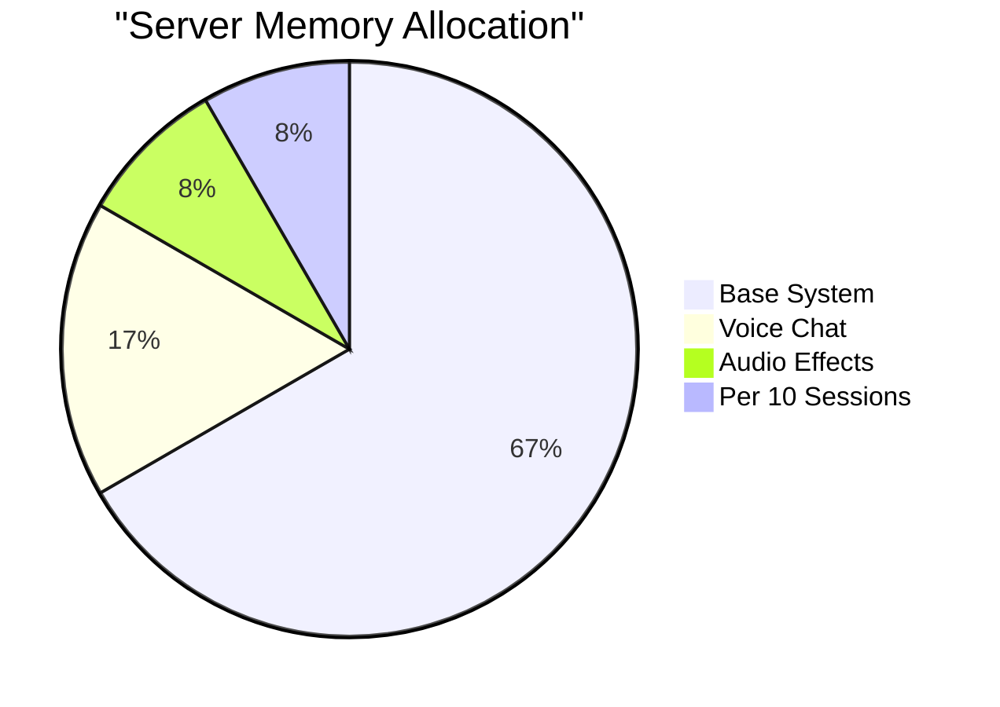
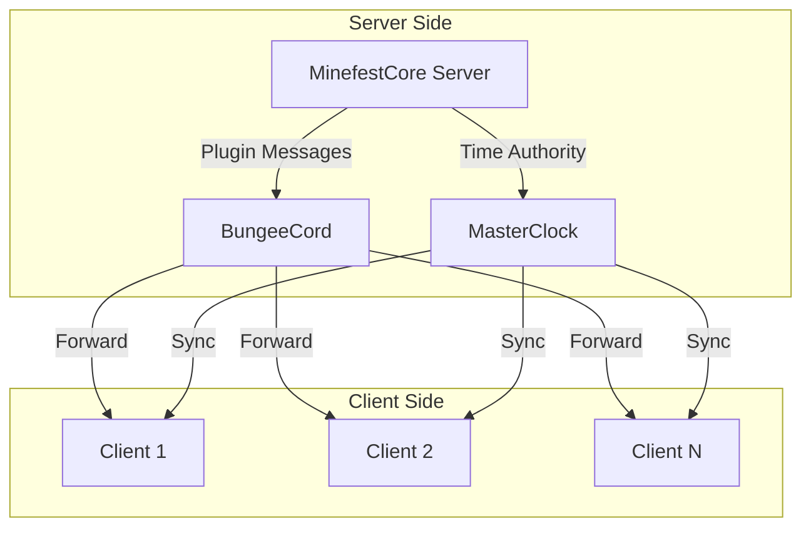
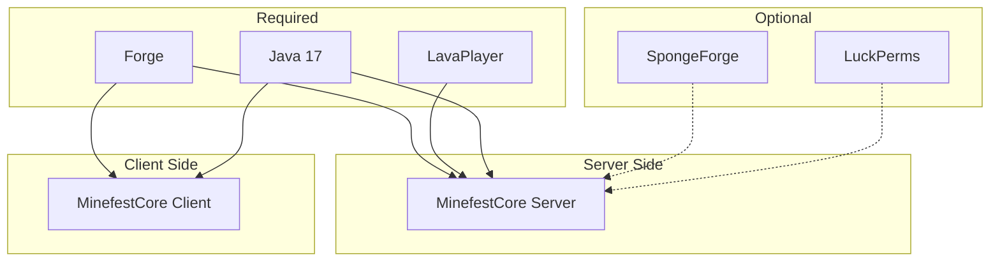

# Minefest-Core Architecture

## System Overview

## Component Separation

## Audio System Flow

## Time Synchronization

## Configuration System

## Event Flow

## Memory Management

## Network Communication

## Component Dependencies

These diagrams provide a visual representation of:
1. Overall system architecture with side-specific components
2. Component separation between client and server
3. Audio streaming flow across client and server
4. Time synchronization mechanism
5. Side-specific configuration structure
6. Event state management for both sides
7. Server memory allocation
8. Network communication patterns
9. Component dependencies for both client and server

The diagrams use Mermaid syntax, which can be rendered by many Markdown viewers and GitHub. 